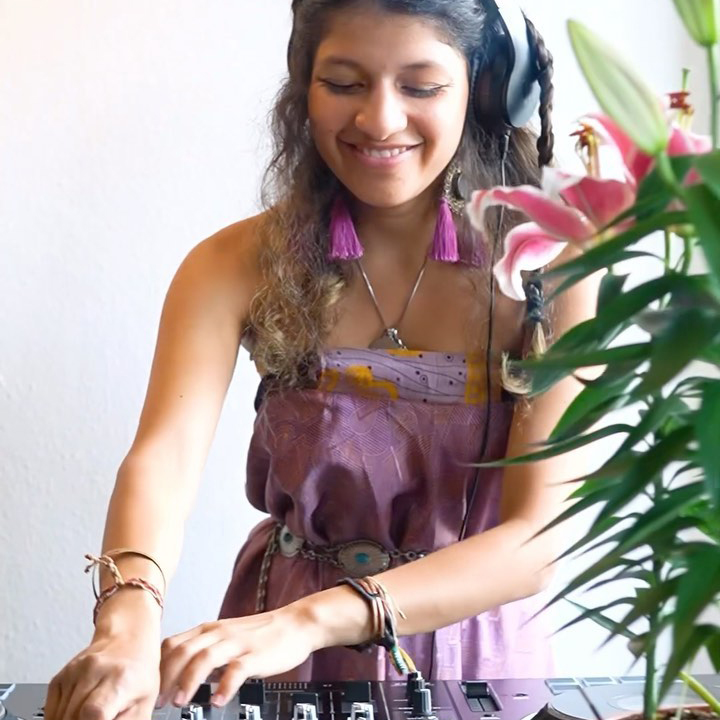
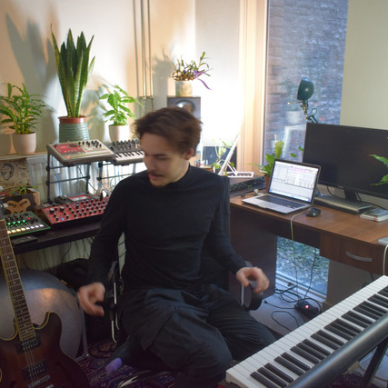
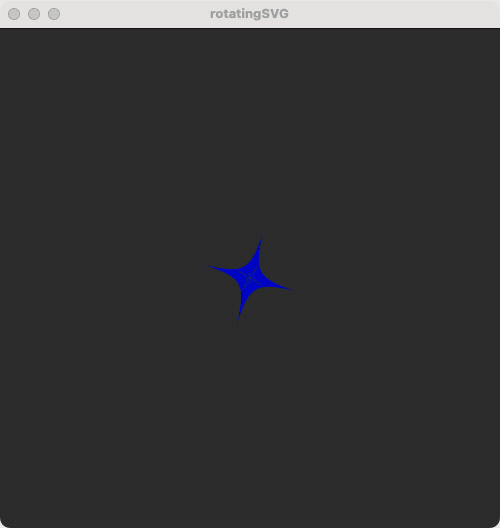
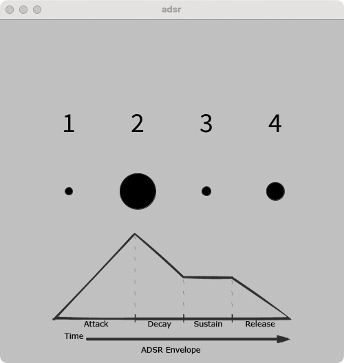

# BPM timings for Processing

## Introduction
BPM timings for Processing is a small library for Processing that provides easy to use timing functions based on beats per minute. For example, you could easily grow or shrink shapes in any amount of beats, or delay shrinking a shape to start after 6 beats.

### Context
This library was created in 2023 for the Maastricht Institute of Arts - GenArt exposition. Students were showcasing their generative art work that could be controlled with a custom built Arduino controller. The work was BPM based; a live band performed on stage while students acted as VJ's, controlling their own digital work through the Arduino controller. For the exposition and performance of 2024, this library was expanded with 2 additional classes: [ArduinoControls](ArduinoControls.md) and [FrequencyAnalyzer](FrequencyAnalyzer.md).

Students collaborated with several artists. Click the thumbnail for more information:

<table width="100%">
  <tr>
    <td valign="top" align="center" width="33%"><a href="context/triana-y-luca.md">Triana y Luca<br></a></td>
    <td valign="top" align="center" width="33%"><a href="context/ananya-samyt.md">Ananya Samyt<br></a></td>
    <td valign="top" align="center" width="33%"><a href="context/gogo.md">Gogo<br></a></td>
  </tr>
 </table>


## How to install
Install the library by downloading the latest release through the Processing contribution manager: go to `Processing > Sketch > Import Library... > Manage Libraries...` and search for "BPM timings" and click install.

## Usage

```
import bpm.library.beatsperminute.*;
BeatsPerMinute bpm;

void setup() {
  size(500, 500);
  bpm = new BeatsPerMinute(this);
  bpm.setBPM(30);
}

void draw() {
  background(50);
  circle(width/2, height/2, bpm.easeBounce()*500);
}
```


The BeatsPerMinute class provides the following main functions:
* `linear()` function that returns a normalized linear progress value from 0 to 1 for any given amount of beats, or with a given delay:
  * `linear()` returns progress in 1 beat
  * `linear(4)` returns progress in 4 beats
  * `linear(4,3)` returns progress in 4 beats, with a delay of 3 beats
* `ease()` same as `linear()` but does not use a linear progression but an 'eased' or 'smooth' one. Again, can be called without arguments, with 1 argument (duration in beats) or with two (duration and delay in beats).
* `linearBounce()` same as `linear()` but goes from 0 to 1 to 0 in the same amount of time. Useful for shrinking or growing of visuals.
* `easeBounce()` same as `ease()` but goes from 0 to 1 to 0 in the same amount of time. Useful for shrinking or growing of visuals.
* `every[n]` boolean that returns true every n beats. Returns true for the duration of 1 beat. Limited to a max of 16 beats.
* `every_once[n]` same as `every[n]` but now the boolean returns true for only 1 frame. Useful for changing a variable once every n beats.
* `getBPM()` to return the current BPM.
* `getBeatCount()` to return the current beatcount.
* `getSurfaceTitle()` show information on BPM, beatCount and frameRate in your surface title. To be used in your main sketch like `surface.setTitle(bpm.getSurfaceTitle());`

A more advanced progression function `adsr()` that uses attack, decay, sustain and release options to control the (linear) progression:
* `adsr(0.2)` function that uses an attack of 20% to get from 0 to 1 and stay at 1 for the remainder of the beat
* `adsr(0.2, 0.4, 0.5, 0.1)` function that uses an attack of 20% to get from 0 to 1, a decay of 40% to get to 0.5, stay for 30% of the time at that 0.5 and uses a release of 10% to get from 0.5 to 0.
* `adsr(0.2, 0.4, 0.5, 0.1, 2)` similar as the previous one, but with an additional parameter for duration in beats. In this case to animate over 2 beats.
* `adsr(0.2, 0.4, 0.5, 0.1, 2, 1)` similar as the previous one, but with an additional parameter for delay in beats. In this case delay of 1 beat.

You can tweak the behaviour of this library with the following functions (you can also chain them when initializing your bpm object for clarity):
* `.setBPM(120)` to change the amount of beats per minute for all calculations.
* `.showInfoPanel()` to show the infopanel.
* `.setInfoPanelY(n)` to offset the starting y-position of the infopanel by n pixels. Useful for when you have multiple infopanels to get them all lined up.
* `.setInfoPanelKey('u')` to change the hotkey to toggle the infopanel. Useful for when you have multiple infopanels. Defaults to 'i'.
* `.disableKeyPress()` to disable listening for keypresses. If you don't disable keypresses, then these keypresses will work by default:
  * `0` press once to reset timer, press multiple times to set the BPM to your 'press'-timing
  * `-` lower bpm
  * `+` raise bpm


## Examples
You can find all these examples in `Processing -> File - Examples - Contributed Libraries - BPM timings - BPM_Timings`.

<table width="100%">

  <tr>
    <td valign="top" align="center" width="33%"><a href="https://github.com/vincentsijben/bpm-timings-for-processing/blob/master/examples/BPM_Timings/animatedSVG/animatedSVG.pde">animatedSVG</a><br></td>
    <td valign="top" align="center" width="33%"><a href="https://github.com/vincentsijben/bpm-timings-for-processing/blob/master/examples/BPM_Timings/beatcount/beatcount.pde">beatCount</a><br></td>
    <td valign="top" align="center" width="33%"><a href="https://github.com/vincentsijben/bpm-timings-for-processing/blob/master/examples/BPM_Timings/colorPalettes/colorPalettes.pde">animatedSVG</a><br></td>
  </tr>
   <tr>
    <td valign="top" align="center" width="33%"><a href="https://github.com/vincentsijben/bpm-timings-for-processing/blob/master/examples/BPM_Timings/delay/delay.pde">delay</a><br></td>
    <td valign="top" align="center" width="33%"><a href="https://github.com/vincentsijben/bpm-timings-for-processing/blob/master/examples/BPM_Timings/metronome/metronome.pde">metronome</a><br></td>
    <td valign="top" align="center" width="33%"><a href="https://github.com/vincentsijben/bpm-timings-for-processing/blob/master/examples/BPM_Timings/randomColor/randomColor.pde">randomcolor</a><br></td>
  </tr>
  <tr>
    <td valign="top" align="center" width="33%"><a href="https://github.com/vincentsijben/bpm-timings-for-processing/blob/master/examples/BPM_Timings/randomGridSpots/randomGridSpots.pde">randomGridSpots</a><br></td>
    <td valign="top" align="center" width="33%"><a href="https://github.com/vincentsijben/bpm-timings-for-processing/blob/master/examples/BPM_Timings/rotatingSVG/rotatingSVG.pde">rotatingSVG</a><br></td>
    <td valign="top" align="center" width="33%"><a href="https://github.com/vincentsijben/bpm-timings-for-processing/blob/master/examples/BPM_Timings/adsr/adsr.pde">adsr</a><br></td>
  </tr>
 
 </table>


## Contribute to this library
See [noteToSelf.md](noteToSelf.md).