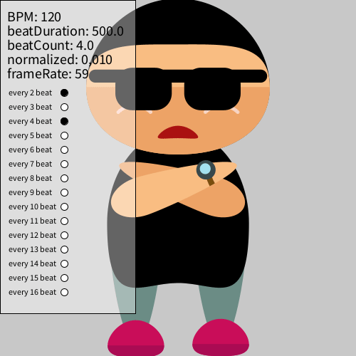
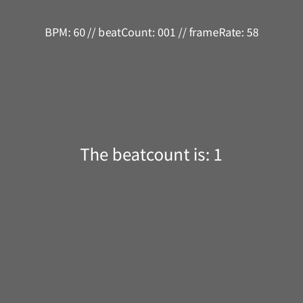
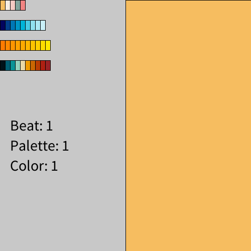
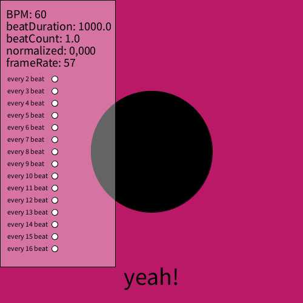
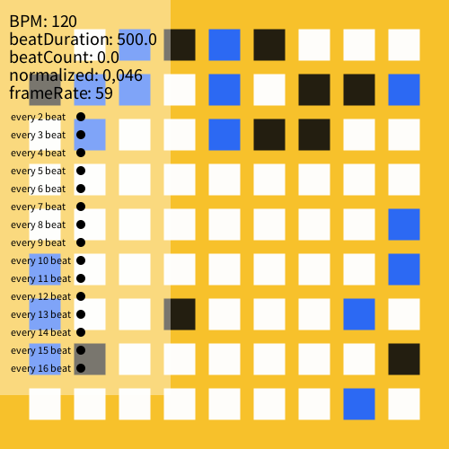

# BPM timings for Processing

## Introduction
BPM timings for Processing is a small library for Processing that provides easy to use timing functions based on beats per minute. For example, you could easily grow or shrink shapes in any amount of beats, or delay shrinking a shape to start after 6 beats.

It provides the following main functions:
* `linear()` function that returns a normalized linear progress value from 0 to 1 for any given amount of beats, or with a given delay:
  * `linear()` returns progress in 1 beat
  * `linear(4)` returns progress in 4 beats
  * `linear(4,3)` returns progress in 4 beats, with a delay of 3 beats
* `ease()` same as `linear()` but does not use a linear progression but an 'eased' one, using the first quarter part of a sine function. Again, can be called without arguments, with 1 argument (duration in beats) or with two (duration and delay in beats).
* `linearBounce()` same as `linear()` but goes from 0 to 1 to 0 in the same amount of time. Useful for shrinking or growing of visuals.
* `easeBounce()` same as `ease()` but goes from 0 to 1 to 0 in the same amount of time. Useful for shrinking or growing of visuals.
* `every[n]` boolean that returns true every n beats. Returns true for the duration of 1 beat. Limited to a max of 16 beats.
* `every_once[n]` same as `every[n]` but now the boolean returns true for only 1 frame. Useful for changing a variable once every n beats.
* `getBPM()` to return the BPM as an integer.
* `setSurfaceTitle()` show information on BPM, beatCount and frameRate in your surface title.

You can tweak the behaviour of this library with the following functions (you can chain them):
* `setBPM(120)` to change the amount of beats per minute for all calculations.
* `showInfoPanel()` to show the infopanel.
* `setInfoPanelY(n)` to change the starting y-position of the infopanel. Useful for when you have multiple infopanels to get them all lined up.
* `setInfoPanelKey('u')` to change the hotkey to toggle the infopanel. Useful for when you have multiple infopanels. Defaults to 'i'.
* `disableKeyPress()` to disable listening for keypresses. If you don't disable keypresses, then these keypresses will work:
  * `0` press once to reset timer, press multiple times to set the BPM to your 'press'-timing
  * `-` lower bpm
  * `+` raise bpm

## How to install
Install the library by downloading the latest release through the Processing contribution manager: go to `Processing > Sketch > Import Library... > Manage Libraries...` and search for "BPM timings" and click install.

## Usage

```
// Import the library to your sketch
import bpm.library.*;

// Create the bpm object
BeatsPerMinute bpm;

void setup(){
  size(500,500);

  // Initialize the bpm object
  bpm = new BeatsPerMinute(this)
    //.setBPM(120)           // set the starting bpm to 120
    .showInfoPanel()         // show the infopanel at the start
    //.setInfoPanelY(200)    // set the y location of the infopanel to 200
    //.setInfoPanelKey('o')  // set the hotkey for toggling the infopanel to 'o'
    //.disableKeyPress()     // disable listening to keypresses
    ;
}

void draw(){
  background(100);
  
  // Use a timing function from the bpm object
  float radius = 20 + bpm.linear() * 50;
  // or: float radius = map(bpm.linear(), 0, 1, 20, 70);
  // or: float radius = lerp(20, 70, bpm.linear());
  circle(width/2, height/2, radius);
}
```

## Examples
You can find all these examples in `Processing -> File - Examples - Contributed Libraries - BPM timings`.

| [animatedSVG](https://github.com/vincentsijben/bpm-timings-for-processing/blob/master/examples/BPM_Timings/animatedSVG/animatedSVG.pde) | [beatcount](https://github.com/vincentsijben/bpm-timings-for-processing/blob/master/examples/BPM_Timings/beatcount/beatcount.pde) | [colorPalettes](https://github.com/vincentsijben/bpm-timings-for-processing/blob/master/examples/BPM_Timings/colorPalettes/colorPalettes.pde) |
|-----------------------------------------------------------------------------------------------------------------------------|-----------------------------------------------------------------------------------------------------------------------|-----------------------------------------------------------------------------------------------------------------------|
|                            |                          |                          |
|  |  |
| [delay](https://github.com/vincentsijben/bpm-timings-for-processing/blob/master/examples/BPM_Timings/delay/delay.pde) | [metronome](https://github.com/vincentsijben/bpm-timings-for-processing/blob/master/examples/BPM_Timings/metronome/metronome.pde) | [randomColor](https://github.com/vincentsijben/bpm-timings-for-processing/blob/master/examples/BPM_Timings/randomColor/randomColor.pde) |
|                            |                          |                          |
|||
| [randomGridSpots](https://github.com/vincentsijben/bpm-timings-for-processing/blob/master/examples/BPM_Timings/randomGridSpots/randomGridSpots.pde) |  |  |
| |||
|||


## Note to self
I've copied `library.properties` to the root and called it `library.properties.example` so I could see the original comments for the file. In `resources\library.properties` I've removed all comments, so the generated `distribution\...\.txt` file is clean and simple.

### Update, test and release
* Open Eclipse
* Update `src\bpm.library\BeatsPerMinute.java`
* Open Ant window `Window -> Show View - Ant`
* drag `resources\build.xml` to the Ant window on the right
* Run the Ant build
* Test every embedded example locally through the `Processing -> File -> Examples`
* Commit changes to GitHub and create a new release
* Name the release `BPM Library Release [version] ([pretty version])` and tag it wit tag **latest**
* Upload the `distribution\BPM-[version]\download\BPM.txt` and `distribution\BPM-[version]\download\BPM.zip` into the release.
* Remove the **latest** tag from older versions

### Debugging issues
* Always check the build.properties files. I've been down a rabithole for 4 hours finding out I had changed my Documents folder location and the build.properties still had `sketchbook.location=${user.home}/Documents/Processing` instead of the new `sketchbook.location=${user.home}/Docs/Processing`

## Create your own Processing Library
Thanks [Elie Zananiri](https://github.com/prisonerjohn) for pointing out these things...

There are a few steps:
* Package your library according to the guidelines here: https://github.com/processing/processing/wiki/Library-Guidelines
* Add a properties file according to the guidelines here: https://github.com/processing/processing/wiki/Library-Basics#describing-your-library--libraryproperties
* Check the revision numbers for Processing 4 [here](https://github.com/processing/processing4/blob/main/build/shared/revisions.md).
* Publish your library and properties to a static URL according to the guidelines here: https://github.com/processing/processing/wiki/Library-Basics#advertising-your-library

* If you're hosting your library on GitHub, use the GitHub Releases feature. Create a release tagged "latest" and move that tag up to the new commit whenever you make an update. Note that you can also tag each release with its version number, in case you want to make older releases still available on GitHub. Check out [processing-video]() for a good example of that.

So my URLs are always available through:
* https://github.com/vincentsijben/bpm-timings-for-processing/releases/download/latest/BPM.txt
* https://github.com/vincentsijben/bpm-timings-for-processing/releases/download/latest/BPM.zip


I've based my Library on the [Processing Library Template](https://github.com/processing/processing-library-template). You could also check out the [Coding Train tutorial](https://www.youtube.com/watch?v=pI2gvl9sdtE). 

Note: 
* use `classpath.local.location=/Applications/Processing.app/Contents/Java/core/library` instead of Daniel's example. When releasing a Library you can't have the `core.jar` in your lib folder.
* Find and comment this line in your build.xml `<taglet name="ExampleTaglet" path="resources/code" />`if you get [errors with generating Javadoc](https://github.com/processing/processing-library-template/issues/19). Find and remove this line in your build.xml as well `stylesheetfile="resources/stylesheet.css"`
* I added a symlink to each and every example folder, so I can directly open up an example in Processing IDE and add new features in the BeatsPerMinute.java file. Processing IDE needs to "see" the .java file in the same directory as the .pde file to work. Unfortunately I haven't found a way for these symlinks to work both on MacOS and Windows at the same time. So according to your dev environment, (re)create the symlinks when necessary. I excluded the .java file in build.xml so they won't show up in production with:
```
<copy todir="${project.tmp}/${project.name}/examples">
	<fileset dir="${project.examples}">
		<exclude name="**/*README*"/>
		<exclude name="**/*.java"/>
	</fileset>
</copy>
```
To create symlinks:
```
# For MacOS: while in the root folder of this project:
ln -s ../../src/bpm/library/BeatsPerMinute.java ./examples/animatedSVG/BeatsPerMinute.java
ln -s ../../src/bpm/library/BeatsPerMinute.java ./examples/beatcount/BeatsPerMinute.java
ln -s ../../src/bpm/library/BeatsPerMinute.java ./examples/colorPalettes/BeatsPerMinute.java
ln -s ../../src/bpm/library/BeatsPerMinute.java ./examples/delay/BeatsPerMinute.java
ln -s ../../src/bpm/library/BeatsPerMinute.java ./examples/metronome/BeatsPerMinute.java
ln -s ../../src/bpm/library/BeatsPerMinute.java ./examples/randomColor/BeatsPerMinute.java
ln -s ../../src/bpm/library/BeatsPerMinute.java ./examples/randomGridSpots/BeatsPerMinute.java

# For Windows: while in the root folder of this project:
mklink .\examples\animatedSVG\BeatsPerMinute.java "..\..\src\bpm\library\BeatsPerMinute.java"
mklink .\examples\beatcount\BeatsPerMinute.java "..\..\src\bpm\library\BeatsPerMinute.java"
mklink .\examples\colorPalettes\BeatsPerMinute.java "..\..\src\bpm\library\BeatsPerMinute.java"
mklink .\examples\delay\BeatsPerMinute.java "..\..\src\bpm\library\BeatsPerMinute.java"
mklink .\examples\metronome\BeatsPerMinute.java "..\..\src\bpm\library\BeatsPerMinute.java"
mklink .\examples\randomColor\BeatsPerMinute.java "..\..\src\bpm\library\BeatsPerMinute.java"
mklink .\examples\randomGridSpots\BeatsPerMinute.java "..\..\src\bpm\library\BeatsPerMinute.java"
```
ArduinoControls examples:
```
ln -s ../../../src/bpm/library/ArduinoControls.java ./examples/ArduinoControls/basics/ArduinoControls.java
ln -s ../../../src/bpm/library/LED.java ./examples/ArduinoControls/basics/LED.java
ln -s ../../../src/bpm/library/LEDMode.java ./examples/ArduinoControls/basics/LEDMode.java
ln -s ../../../src/bpm/library/Potentiometer.java ./examples/ArduinoControls/basics/Potentiometer.java
ln -s ../../../src/bpm/library/PushButton.java ./examples/ArduinoControls/basics/PushButton.java
ln -s ../../../src/bpm/library/InfoPanel.java ./examples/ArduinoControls/basics/InfoPanel.java
```
FrequencyAnalyzer examples:
```
ln -s ../../../src/bpm/library/FrequencyAnalyzer.java ./examples/FrequencyAnalyzer/basics/FrequencyAnalyzer.java
ln -s ../../../src/bpm/library/InputMode.java ./examples/FrequencyAnalyzer/basics/InputMode.java
ln -s ../../../src/bpm/library/InfoPanel.java ./examples/FrequencyAnalyzer/basics/InfoPanel.java
```
BPM_Timing examples:
```
ln -s ../../../src/bpm/library/BeatsPerMinute.java ./examples/BPM_Timings/animatedSVG/BeatsPerMinute.java
ln -s ../../../src/bpm/library/InfoPanel.java ./examples/BPM_Timings/animatedSVG/InfoPanel.java
ln -s ../../../src/bpm/library/BeatsPerMinute.java ./examples/BPM_Timings/beatcount/BeatsPerMinute.java
ln -s ../../../src/bpm/library/InfoPanel.java ./examples/BPM_Timings/beatcount/InfoPanel.java
ln -s ../../../src/bpm/library/BeatsPerMinute.java ./examples/BPM_Timings/colorPalettes/BeatsPerMinute.java
ln -s ../../../src/bpm/library/InfoPanel.java ./examples/BPM_Timings/colorPalettes/InfoPanel.java
ln -s ../../../src/bpm/library/BeatsPerMinute.java ./examples/BPM_Timings/delay/BeatsPerMinute.java
ln -s ../../../src/bpm/library/InfoPanel.java ./examples/BPM_Timings/delay/InfoPanel.java
ln -s ../../../src/bpm/library/BeatsPerMinute.java ./examples/BPM_Timings/metronome/BeatsPerMinute.java
ln -s ../../../src/bpm/library/InfoPanel.java ./examples/BPM_Timings/metronome/InfoPanel.java
ln -s ../../../src/bpm/library/BeatsPerMinute.java ./examples/BPM_Timings/randomColor/BeatsPerMinute.java
ln -s ../../../src/bpm/library/InfoPanel.java ./examples/BPM_Timings/randomColor/InfoPanel.java
ln -s ../../../src/bpm/library/BeatsPerMinute.java ./examples/BPM_Timings/randomGridSpots/BeatsPerMinute.java
ln -s ../../../src/bpm/library/InfoPanel.java ./examples/BPM_Timings/randomGridSpots/InfoPanel.java
```
All_combined:
```
ln -s ../../../src/bpm/library/ArduinoControls.java ./examples/All_combined/startercode/ArduinoControls.java
ln -s ../../../src/bpm/library/LED.java ./examples/All_combined/startercode/LED.java
ln -s ../../../src/bpm/library/LEDMode.java ./examples/All_combined/startercode/LEDMode.java
ln -s ../../../src/bpm/library/Potentiometer.java ./examples/All_combined/startercode/Potentiometer.java
ln -s ../../../src/bpm/library/PushButton.java ./examples/All_combined/startercode/PushButton.java
ln -s ../../../src/bpm/library/InfoPanel.java ./examples/All_combined/startercode/InfoPanel.java
ln -s ../../../src/bpm/library/FrequencyAnalyzer.java ./examples/All_combined/startercode/FrequencyAnalyzer.java
ln -s ../../../src/bpm/library/InputMode.java ./examples/All_combined/startercode/InputMode.java
ln -s ../../../src/bpm/library/BeatsPerMinute.java ./examples/All_combined/startercode/BeatsPerMinute.java
```
