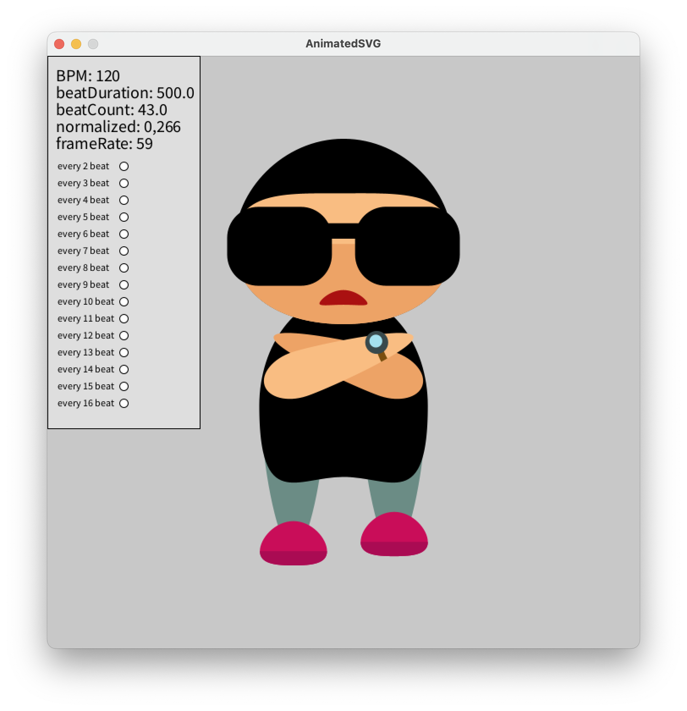
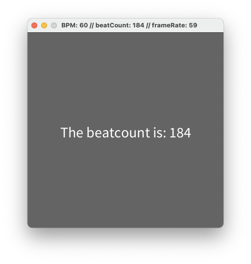
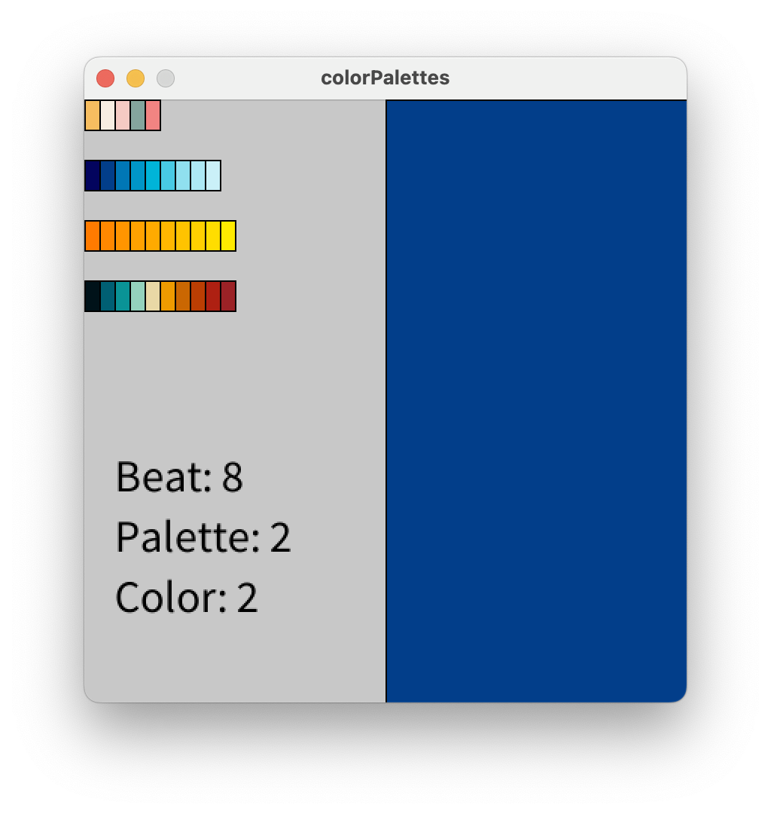
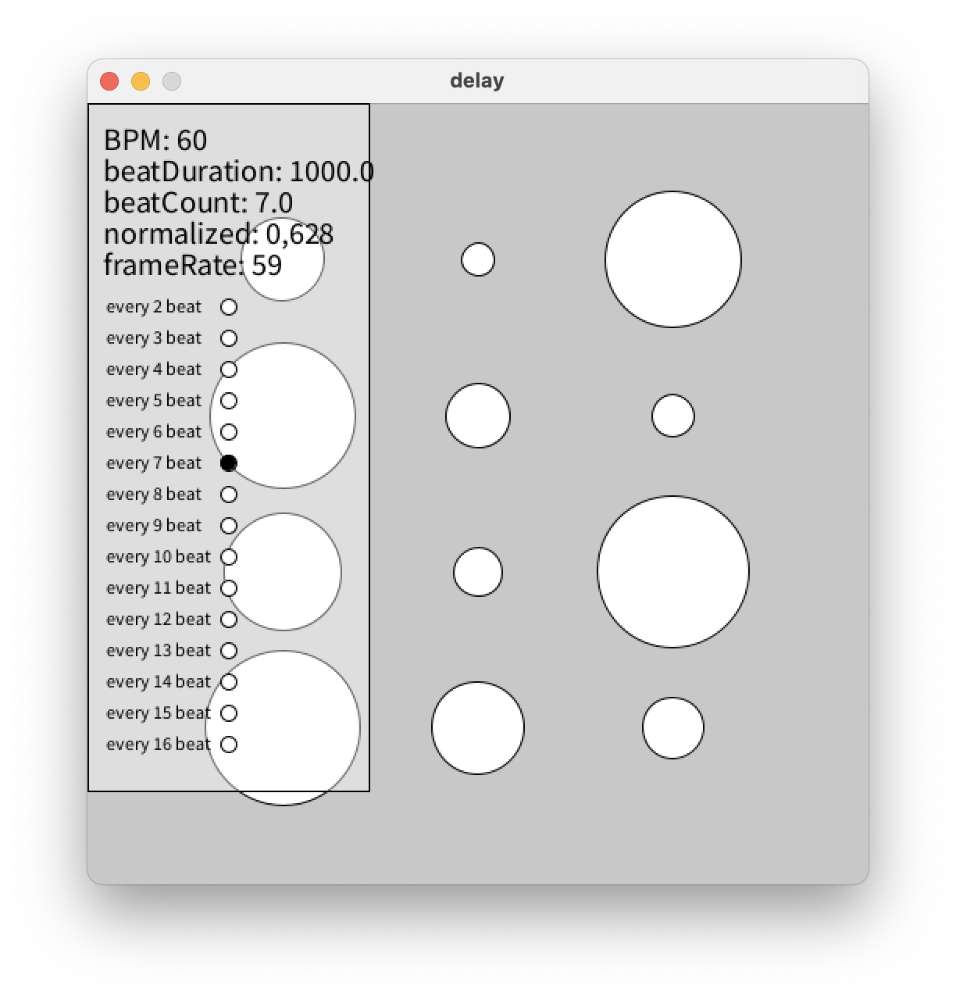
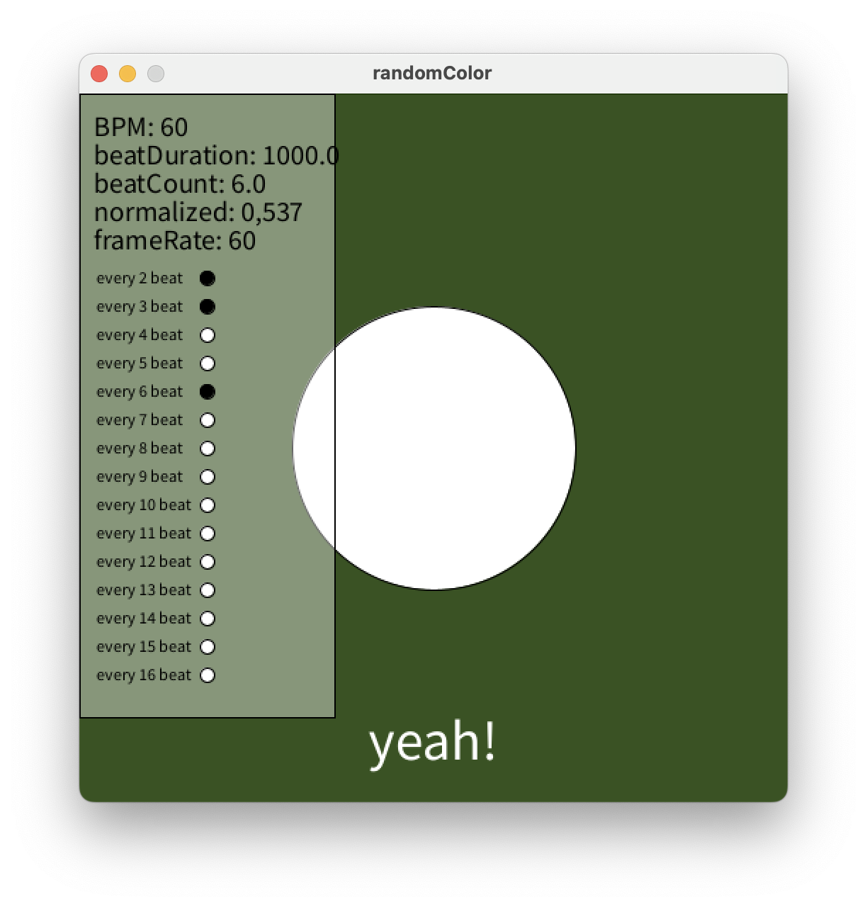
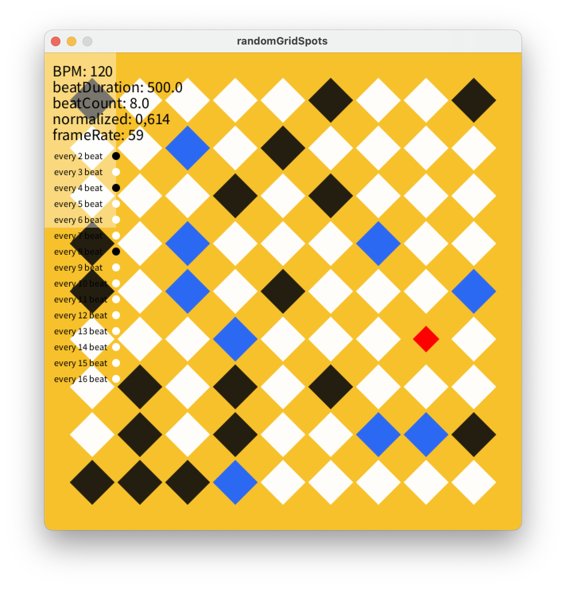
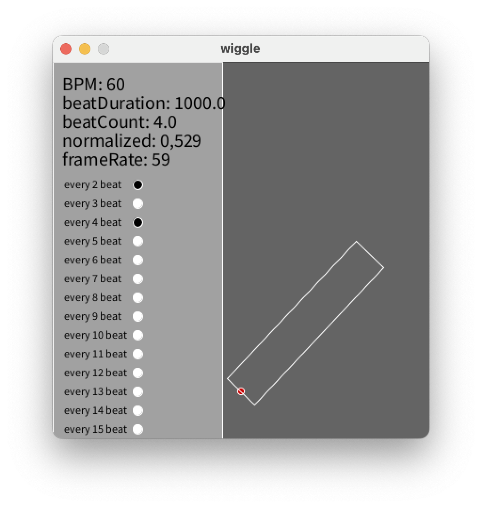

# BPM timings for Processing

## Introduction
BPM timings for Processing is a small library for Processing that provides easy to use timing functions based on beats per minute. For example, you could easily grow or shrink shapes in any amount of beats, or delay shrinking a shape to start after 6 beats.

## How to
Install the library by downloading the latest release of through the Processing contribution manager: go to `Processing > Sketch > Import Library... > Manage Libraries...` and search for "BPM timings" and click install.

## Usage

```
// Import the library to your sketch
import bpm.library.*;

// Create the bpm object
BeatsPerMinute bpm;

void setup(){
  // Initialize the bpm
  bpm = new BeatsPerMinute(this, 60);

  // Enable the info window when pressing i
  // or raise/lower bpm with = and -
  // or reset timing with 0
  bpm.enableKeyPresses();

  // always show the info window
  bpm.showInfo = true;
}

void draw(){
  background(100);
  
  // Use a timing function
  float radius = 20 + bpm.linear() * 50;
  // or: float radius = map(bpm.linear(), 0, 1, 20, 70);
  // or: float radius = lerp(20, 70, bpm.linear());
  ellipse(width/2,height/2,radius,radius);

  // Run the timing every frame
  bpm.run();
}
```

## Examples
You can find all these examples in `Processing -> File - Examples - Contributed Libraries - BPM timings for Processing`.

### animatedSVG


### beatcount


### colorPalettes


### delay


### randomColor


### randomGridSpots


### wiggle



Library template based on the [Processing Library Template](https://github.com/processing/processing-library-template). If you want to create your own library check out the [Coding Train tutorial](https://www.youtube.com/watch?v=pI2gvl9sdtE).
