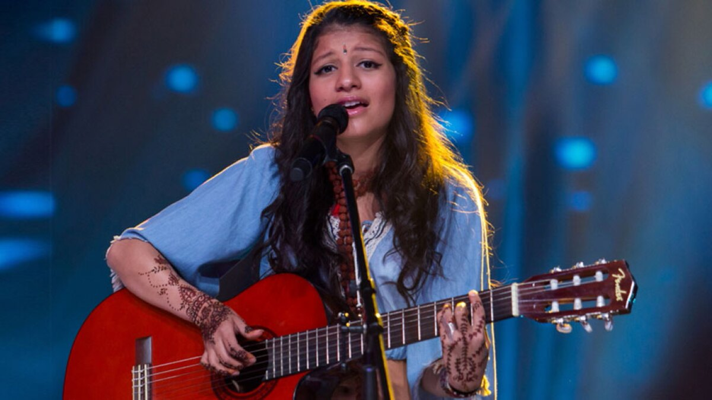

# Ananya Samyt ([Instagram](https://www.instagram.com/ananyasamyt/))

Singer, live performer, producer and Dj Ananya Samyt takes her **Colombian and Indian heritage** as the main influence for her music. 

During her Jazz studies at the Conservatorium Maastricht, she started **a fusion of jazz and electronic** music production, whilst adding some of her magic sounds and inspiration that reflects the vibrant diversity of her heritage. 

She will perform with a song from the new album she is working on right now called: “**Electronic&Analogue Frequencies**”, an experimentation of dance music with synths sounds, live instruments and her voice.

